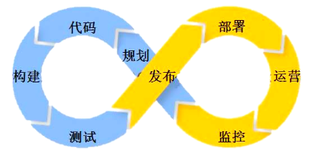

tag:gitlab CI lerna devops

- [前言](#%e5%89%8d%e8%a8%80)
- [lerna](#lerna)
- [gitlab & gitlab CI](#gitlab--gitlab-ci)

## 前言

近期在一家创业公司做架构师。然而由于测试负责人出走，我也就负责起devops相关的工作。何谓devops？简而言之就是打破开发（development）和运维（operation）的隔阂，让开发介入到运维中，一套流水工具链，谁开发谁部署。开发懂得了运维环境，也会帮助开发调优程序，提高开发效率。

开发掌控整套体系是很有价值的。整个过程中都有开发需要去了解的东西，辅助我们打造高质量的软件系统。

- 规划：设计代码（开发本职）
- 代码：编写代码（开发本职）
- 构建：代码规范、编译环境、静态检查、增量构建（辅助编写pretty code）
- 测试：自动化单元测试、模块测试（辅助编写bugfree code）
- 发布：二进制发布、源码发布（对发布结果做恰当的版本控制）
- 部署：部署环境、分布式、带宽、防火墙（软件运行真实环境）
- 运营：日志管理、私有命令（如何有效定位bug、高效恢复业务）
- 监控：内存、CPU、日志异常（如何在异常中恢复，有效利用有限的资源）

与devops相似的一个概念是CI（持续集成）。所谓持续集成，便是在合入代码或者周期性地执行devops的整个流程，保证时刻都有最新的符合最低质量要求的产品。

选择怎样的工具来支撑呢？我接触过的工具有TeamCity、Jenkins、GitlabCI，当然还有一些自研的或者其他部署工具扩展出来的CI（比如容器编排工具rancher这种。）。

TeamCity社区版本免费可用，界面好看，配置也方便，支持的最大并发数有限。Jenkins完全开源，插件丰富，用心搞可以支撑任意你想做的东西。GitlabCI是gitlab自带，文档丰富，用心挖掘也能做很多事情。

## lerna

## gitlab & gitlab CI

