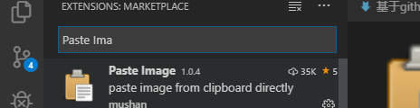
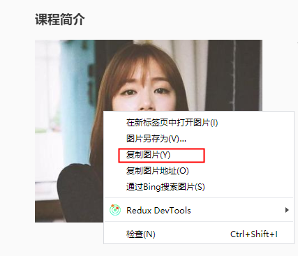
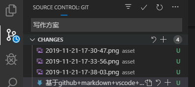

- [写作困境](#%e5%86%99%e4%bd%9c%e5%9b%b0%e5%a2%83)
- [环境配置](#%e7%8e%af%e5%a2%83%e9%85%8d%e7%bd%ae)
  - [配置github](#%e9%85%8d%e7%bd%aegithub)
  - [配置markdown](#%e9%85%8d%e7%bd%aemarkdown)
  - [vim](#vim)
  - [vscode](#vscode)
- [写作](#%e5%86%99%e4%bd%9c)
- [提交](#%e6%8f%90%e4%ba%a4)
- [预览一下](#%e9%a2%84%e8%a7%88%e4%b8%80%e4%b8%8b)
- [结语](#%e7%bb%93%e8%af%ad)

## 写作困境

当我想写一片文章的时候，我考虑的是这么几点：

1. 编写文字是否方便？（有无vim键盘映射？）
2. 编辑环境是否熟悉？（需不需要使用新的编辑器？是否需要购买？）
3. 文字、图片是否安全可控、稳定可靠？（内容是否版本可控制？是否有app版编辑器？图片会不会有丢失可能？）
4. 是否支持markdown？

作为技术人员，平常写最多的就是代码。目前是比较喜欢vscode的轻量、高效、丰富插件库、高度可定制。平时写代码都是使用vim的键盘映射，编写效率666，即便写中文也比较舒心。因而自然也希望能在vscode下写东西，毕竟人家首先是编辑器，然后才是代码编辑器。如果切换使用别的编辑器，好的编辑器要花钱购买，普通的编辑器可能没法定制，难受。选来选去还是觉得使用vscode算了。

写过论文的都明白，像Latex这种把格式和内容分开的描述语言，都会大大简化内容输出者的工作量。毕竟格式大多都是统一的，而且精华也是在内容。markdown这种描述语言更是表现的极致，只采用少量精简的符号帮助我们说明格式。即便直接看源码也能很连贯地看完内容。vscode自带了markdown的解析和实时预览，而且也有丰富markdown相关的插件，不得不说很适合编写文字。

图片如何存储？网络搜索“图床”便有很多教你搭建图床或者使用免费图床的教程。然而，我总觉得把图片放到别处不安全。图片是文章的重要描述内容，缺图很容易导致内容作废。所以最好还是和文字放到一块。把图片转换成base64嵌入文章中也是一种方式，但是太大，太长，让文章在编写的时候很恼火。最好的方式还是把图片放在markdown文件附近，markdown源码相对索引。

git存储是最佳的版本控制方法。github/gitee等代码仓库，不仅提供无上限的云存储能力，同时也支持markdown解析，无疑给markdown编写的文章一种极佳的存储环境。活跃使用github也让程序员们成就感+1。可惜的是github在墙外，访问慢。使用github还是国内的gitee，需要自己斟酌了。

综上所述：github+markdown+vscode+vim可能是一种比较合适的写作方式了。

## 环境配置

### 配置github

这个比较简单。

1. 在github上创建合适的仓库（private/public）
2. clone到本地
3. 在本地使用ssh-keygen创建一个秘钥对（如果已经有了就不创建了）
4. 把.ssh/id_rsa.pub里面的内容拷贝到github中，添加到放ssh key的地方
5. 以后改动内容就可以直接commit/push了（push到github刚才这个库中）

### 配置markdown

vscode本来就支持markdown。创建.md的文件，文件右上角就有一个Open Preview To Side的按钮，点击后就是直接的预览。插入图片的时候，也能自动搜索路径。

然而vscode不支持图片插入。我们往文章里面插入图片，可能如下几种操作：

- 截屏，粘贴 *****
- 复制图片内容，粘贴 ****
- 复制图片文件，粘贴 **
- 拖入图片 **

以上四种方式，对前两种的需求是最大的，后面两种完全可以被前两种方式代替。vscode有比较合适的插件：Paste Image。它的原理就是：执行一个command，把剪切板的内容写到目标文件夹（配置好的），然后再文章里面插入相应字符串（根据是md还是普通，插入的模板也不一样）。对于本文，建议把图片都放在顶层的asset目录。文件都自动重命名为按照时间顺序的，也比较方便。唯一遗憾的就是不能绝对路径索引图片。这个问题也是无解。

vscode搜索插件，安装Paste Image




如下从网页上拷贝了一张图片内容了



然后再vscode中执行`Ctrl+Shift+P`调出命令，输入或者选中Paste Image，就会插入如下字符串（无论vim在normal模式还是insert模式）

```

```

Preview结果就是如下


整个流程还是很舒畅的。尤其在写文章的时候，我们只会调用到vscode的Paste Image一个命令，通常就是“截图（我常用微信），Ctrl+Shift+P,Enter”就完成了插入图片。

### vim

vscode搜索vim，安装插件就可以了。

### vscode

总共只需要两个插件：vim，Paste Image。足矣。

## 写作

敲键盘+作图/截图/插入，就可以完成文章了。

还有一步：插入目录。写完之后可以在需要插入目录的地方，输入

```
- [第一个标题](#自动弹出的第一个)
```

然后保存，就可以自动刷出其他的目录了，很方便。如果有更新，目录也会在保存的时候自动刷新的。

## 提交

编写文章，使用vscode的版本管理直接commit，push。结束。



如果实在遇到问题，就使用git命令好好解决，毕竟剩下的问题只是版本控制的问题了。

以后要是想换一个仓库，直接换一个方向push就可以了。文章永不丢失，YEAH！

## 预览一下

以提交到gitee为例。本文可以参考[本文gitee地址](https://gitee.com/c0nnyr/public_note/blob/master/notes/misc/%E5%9F%BA%E4%BA%8Egithub+markdown+vscode+vim%E5%86%99%E4%BD%9C%E6%96%B9%E6%A1%88.md)，一切如你所愿。

## 结语

c0nnyr原创。转载请注。